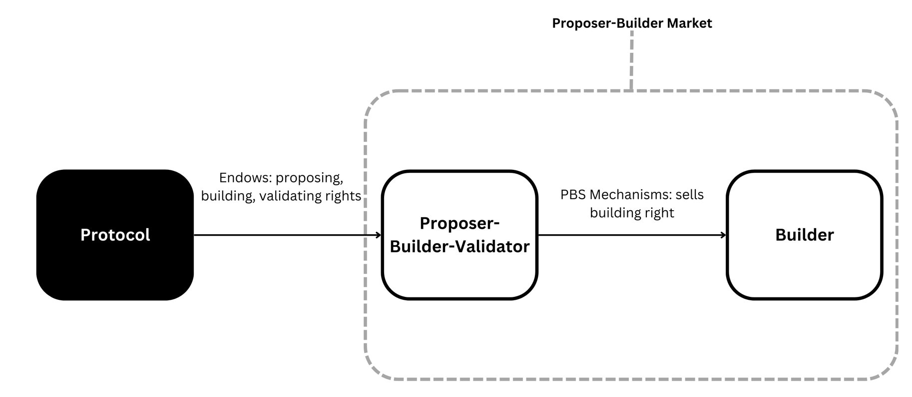
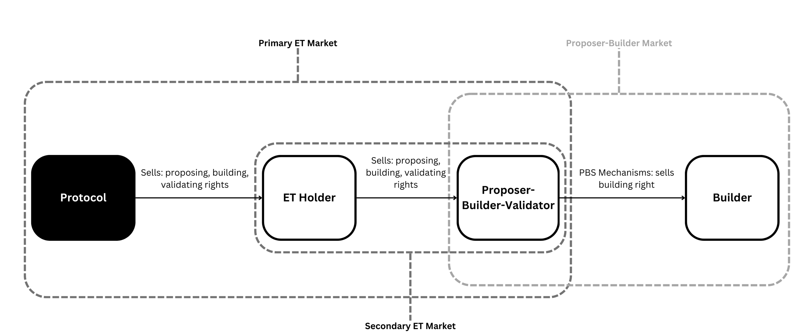
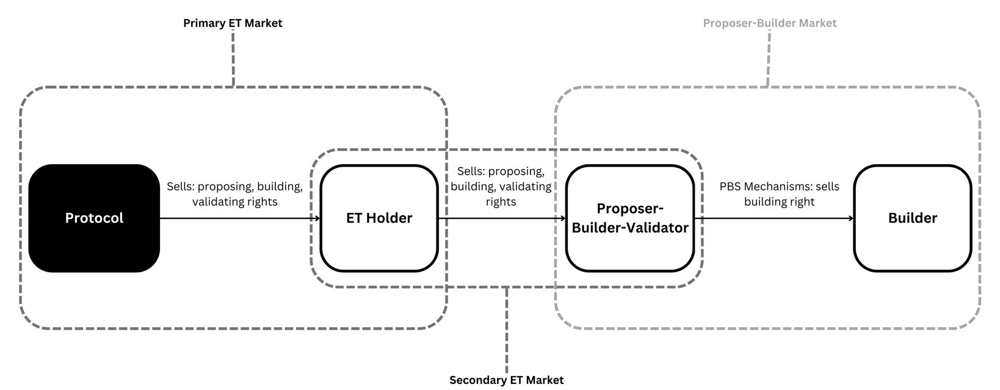

# ET: Why the Secondary Market deserves a Perusal
The nondeterminism of execution tickets leverages the uncertainty of blockspace demand to prevent proposers from exerting multi-slot control. However, nondeterminism enabled by the delay of exercising the proposal right also creates a resale market. This article explores mechanism design models that contemplates secondary exchange. The motviation is twofold. First, the secondary market may enable losers in the primary market, and interested buyers to capitalise on the revealed private valuations in the primary exchange. Second, the forwardness of ETs may confer primary market buyers the control over secondary buyers' exercise of ETs through strategic resale timing. 

Understanding the mutual distortions of players' behaviour in a primary-sedonary market structure sheds light on the optimal primary market designs such as pricing mechanisms.

We model the market of execution tickets (ETs) as that of auctions of block building right where the ticket holder endogeously time the sale initiation. The framework aims to explore a conjectured equivalence between ETs and the spot / just-in-time auctions as mediated by MEV-Boost. ET markets are defined before providing an auction model. For a revenue-, equivalently, MEV-maximizing, and risk neutral proposer, and the execution right matures in a finite period of time, if the proposer optimally sells the right closer to the expiry date, buyers of the ticket must exercise the prposing right immediately. The ET mechanism with deterministic maturity, therefore, becomes a spot auction that takes place at its maturity date. In other words, the ET holder exerts control over the exercise decision of the buyer, hence, the time of the spot auctions, which may spur censorship issues and centralize the ET supply. 

## ET Market
ET is a market that auctions off the right of proposing. 

Consider the ET mechanism:

1. A protocol sells an exogenous supply of ETs to the group of validators. This first round of ET purchase directly from the protocol is the **_primary ET market_**. Each ET confers its holder the proposing right for some future block.

2. One ET is drawn for every block, where its holder wins the proposing right.

3. After the winner's proposal, its ticket is **burned** (permanently removed from the network), and simultaneously a new ET is **minted** (generated) to reiterate the primary market exchange.

A **_secondary ET market_** emerges exactly because of the **_forward nature_** of ETs. ETs may also come with a maturity, requiring that the proposing right be executed within a certain number of forthcoming blocks.

## Secondary Market
There are several reasons why a secondary market should enter the ET design space: 

(a) The textbook logic of resale is that, whenever there is an inefficient allocation in the primary market, resale markets increase welfare by restoring efficiency, that is, ensures the buyer who values the most is allocated the item. However, in ET secondary markets where resale can be driven by arbitrage, primary  market buyers may engage in rent-seeling behaviour: a typical case is where brokers buy up Taylor Swift's tickets quickly once they are on sale. Resale, therefore, can stimulate inefficient behavour in the primary market, but promote efficient reallocations in the secondary. It suggests allowing for secondary ET sales may mitigate centralization effects in the primary as shown by existing studies (Burian, Crapis, and Saleh, 2024; Agentic simulations of ET market, EF, 2024).

(b) Existing theory suggests auctions with resale distorts behavoiour in the primary auction. 

Should there be no ETs, the protocol distriutes a bundle of proposing, building, and validating rights to the (Beacon Chain) proposer by default. The PBS is a class of market mechanisms for the proposer to delegate the building right. 

(Note: an arrow represents a market, pointing from seller to buyer)

With ET, the proposal right is still **_endowed_** by the protocol to the Beacon Chain proposer, but it now sells the building right to Execution Proposers, using the primary ET market.  

However, should the ET holder decide to sell instead of exercise, the secondary market becomes the bridge between primary ET market and the PBS market.

## The Model

We investigate the proposer's decision to sell the ET in the secondary market. Taking the primary ET market as exogenous, we model the secondary market as an auction of proposing rights, with the timing of the sale being endogenous. The model includes the following elements:

- **Risk-neutral, revenue/MEV-maximizing seller/ET holder** $\mathcal{S}$ with a discount rate $d \in (0,1)$.
- **Set of risk-neutral buyers** $i \in \mathcal{N} = \{1, \ldots, n\}$ with the same discount rate. Each buyer can exploit MEV (such as CEX-DEX arbitrage, atomic MEV) at a cost $\theta_i$, which is drawn i.i.d. from a distribution with support $[\underline{\theta}, \bar{\theta}]$.
- For simplicity, we assume no capital requirements for buyers to participate in the auction. To endogenize participation, we may introduce a capital cost $K \geq 0$ to explore the optimal timing of buyer participation.
- **Random variable** $\mathcal{R}$ represents the prize of execution layer rewards, which is the profit from winning the ET to exploit its issuance reward and MEV.
- Without loss of generality, consider an ET ticket of maturity $T \in \mathbb{N}$, with discrete time intervals.

##Endogeneous Sale Timing
##Voluntary Buyer Participation

##Thoughts on Open Questions
###
